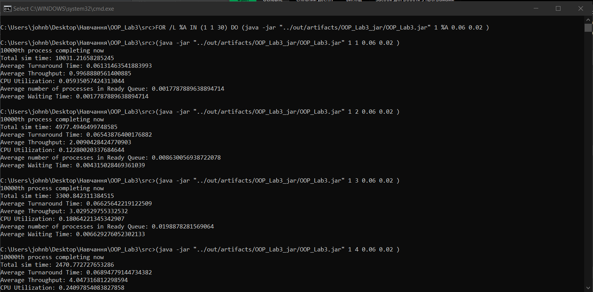
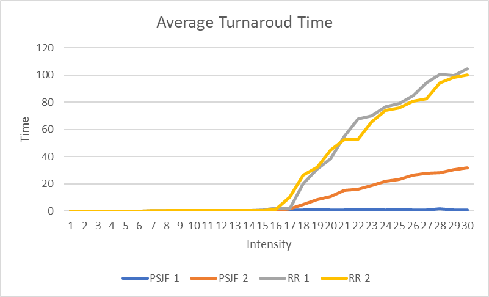
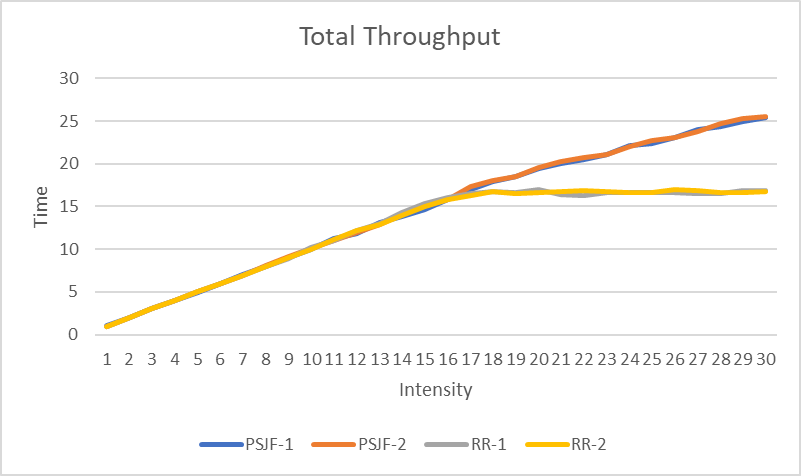
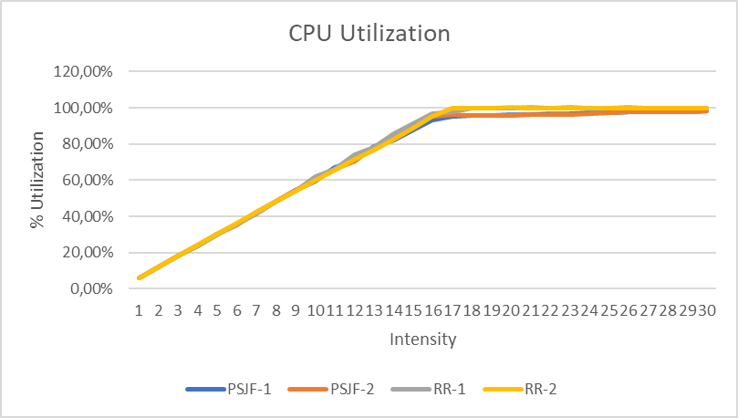
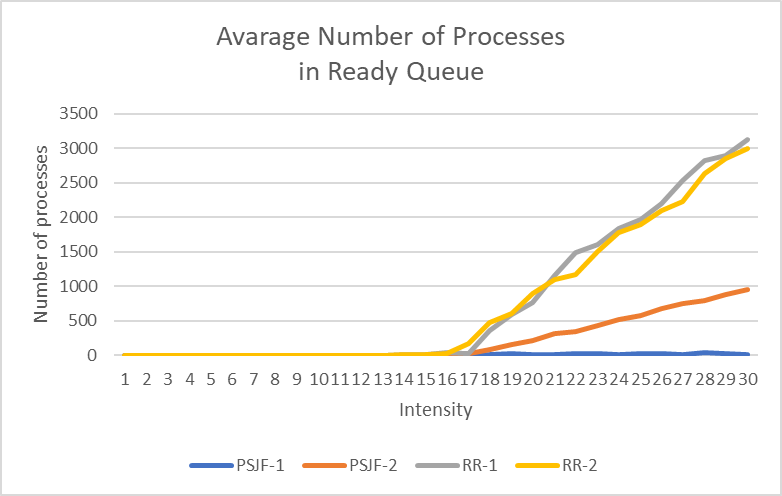
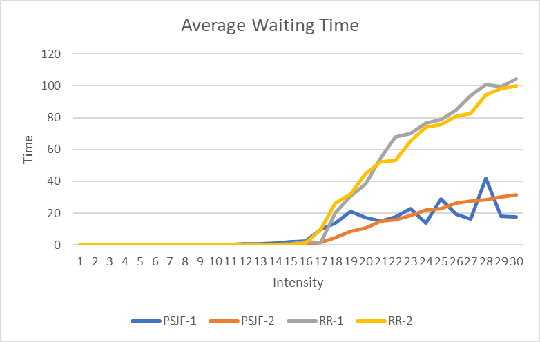
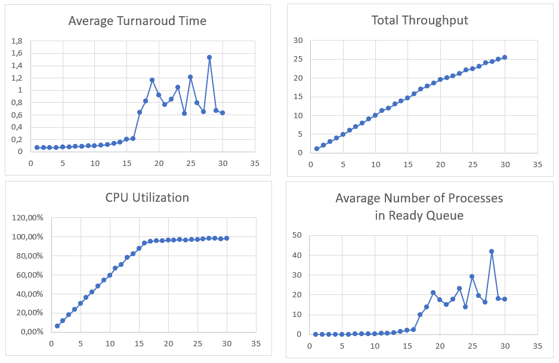
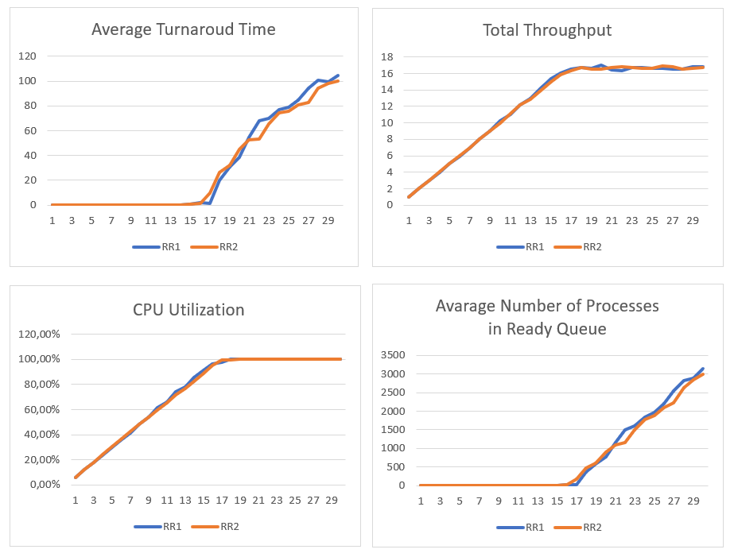

<h1 align="center">Scheduling Algorithms</h1>

Implementation of Round Robin and PSJF scheduling algorithms for a single-processor system.

<h2 align="center">📝 Task</h2>

1. Implement the proposed scheduling algorithm for a single-processor system.
2. Implement the simulation of the appearance of processes in the system at random. For each process, the time of its appearance in the system is generated, the number of cycles required for the operation of the process (which is measured in cycles from the beginning of the simulation) and, if necessary, its priority.
3. The parameters of the system (set by the user) are the range of operating times of the processes, the intensity of the input flow, the quantum, the range of priorities (for priority service disciplines). The system can receive any number of processes, the system should not be overloaded. The end of the study is determined by the user by the number of simulation cycles.
4. For each process with execution time t calculate:
	- `T` - the total residence time of the process in the system.
	- Lost time `M = T - t`;
	- Reactivity coefficient `R = t / T`;
	- Penalty ratio `P = T / t`;
5. Plot graphs of average values of `R` and `P` depending on the intensity when using the process planning algorithm. The program can generate values for graphs, and the graphs themselves can be built by a third-party program.
6. For comparison, also implement a simple scheduling algorithm specified in the task. For a simple planning algorithm, construct the same graphs as given in paragraph 5.
7. Plot graphs: dependences of the average waiting time on the intensity of the input flow of processes, the percentage of CPU downtime on the intensity of the input flow, the dependence of the number of processes on the waiting time at a fixed intensity of the input flow of processes.
8. Explain the form of graphs.
9. In the implementation of the discipline of service to try to achieve a constant complexity of working with the queue.


<h2 align="center">📙 Description of the Program</h2>

<h3 align="center">

`Simulation.java`

</h3>

The main class of the program. This class controls the simulation of a single instance of the scheduler using user-specified command line arguments. The class contains the main _while_ loop, which continues to process events until the completion of 10,000 processes.

At the same time it does not stop and does not interfere with generation of new receipts of processes as it is necessary for exact modeling with reliable statistical results.

I experimented with generating all 10,000 processes in advance, but this caused problems in the distribution and calculated the statistics. Generating new revenue on the fly is the best approach that gives more accurate results.

We have three main types of events - `ProcessArrival`, `ProcessCompletion` and `TimeSliceOccurrence`. The latter is used only by the `Round Robin` scheduler. I decided not to do a fourth, separate event to oust the `PSJF`. Because it happens during simulation, when it is detected, I process it right away.
Each time we plan a process on a CPU, we check whether it is new or returned (already running earlier). Then we can check whether the process is complete or it requires special processing - preemption for `PSJF` or interrupt for `RR`.

If the event:
1) *arrived*: create a process and add it to the scheduler queue
2) *completed*: update the intermediate values required for statistics so that the scheduler starts the next process in `ReadyQueue`, if any, and schedules the event for completion in the future.

As mentioned earlier, the program takes arguments from the command line, the general structure is as follows:

```
java -jar ShenSchedule.jar <scheduler_type> <lambda> <average_service_time> <quantum> <togglePSJFCurve>
```

[`scheduler_type`]: The value can be in the range [1,2].

	1 - Preemptive Shortest Job First Scheduler (PSJF)
	2 - Round Robin Scheduler (RR) - requires the 4th argument that defines the quantum.

[`lambda`]: The intensity value required for the Poisson process to guarantee the exponential time between receipts.

[`average_service_time`]: The service time is selected according to the exponential distribution with the average service time taken from this argument (value in seconds).

[`quantum`]: An optional argument is required only for Round Robin (scheduler_type = 2) (value in seconds).

[`togglePSJFCurve`]: Accepts False or True. Optional argument for switching the PSJF curve from flat (0) to non-flat (1).

<h3 align="center">

`SchedulingAlgorithm.java`

</h3>

Defines the main class for compiling the scheduling algorithm. Contains an abstract definition of properties and behaviors that are shared by all planners.

<h3 align="center">

`RR.java`

</h3>

The class that defines `Round Robin` is inherited from the abstract `SchedulingAlgorithm` class.

<h3 align="center">

`PSJF.java`

</h3>

The class that defines `PSJF` is inherited from the abstract `SchedulingAlgorithm` class.


<h3 align="center">

`PerformanceMetrics.java`

</h3>

An interface that provides a specific template that all planners will need to calculate. Requires constant updating of certain intermediate data (using the values obtained during the processing of each process) throughout the simulation.

<h3 align="center">

`Process.java`

</h3>

Contains common getters and setters for working with the process, also contains values that must be calculated for each process (`start time`, `end time`, `return time`, `waiting time`, `arrival time`, `remainingCpuTime` - used to track the progress of the process on the CPU and whether we can consider it complete or not), these data will be needed both when processing the process and when calculating the overall simulation statistics.

<h3 align="center">

`ProcessReadyQueue.java`

</h3>

This class behaves as a static, declared final to prevent the class from expanding. The private constructor prevents the client code from creating an instance because we do not want to create an instance. All functions of a class are static because the class cannot be created, so you cannot call instance methods or access instance fields.

The process readiness queue is implemented differently depending on the scheduler.
1) If `PSJF` - use the remaining time to sort the queue.
2) If `RR` - a new process is added to the tail of the queue. If the process is not completed within the allocated quantum, then its work is forcibly interrupted and it moves to the tail of the queue. After the quantum, the following process comes out of the head.

The class also contains the `iterateAndGetRemainingDifferenceForRR` method, which is needed to correctly calculate the `RR` of CPU usage. The reason is that after lambda = 16,667 (1 / 0,06 = 16,667) the readiness queue is copied from too many incoming processes. `Round Robin` begins to degenerate and provides quantitative services to some processes that never have time to complete. Here we just add it back to the numerator to get the correct result.

<h3 align="center">

`ProcessRemainingTimeComparator.java`

</h3>

Used by `PSJF` scheduler. Compares processes by residual `CPUTime`, so the process with the least time remaining is the first in the queue.

<h3 align="center">

`CPU.java`

</h3>

The CPU receives the process and:
- sets the start time (`startTime`), if this is the first time the process is serviced;
- sets the `isReturning` process from false to true so that the next time it is identified as a returning process.
- if the processor is running the process, it sets its `isBusy` to true.


<h3 align="center">

`Clock.java`

</h3>

Clock is used for the whole simulation, and counts, in fact, the simulation time.
This class provides a simple setter called in the main simulator control cycle. Clock time is obtained from `EventQueue` (ie from the earliest incoming event, which will be the next to be processed sequentially).


<h2 align="center">🚀 How To Run</h2>


To begin, you need to create a JAR artifact, how to do it read [here](https://www.jetbrains.com/help/idea/compiling-applications.html).

Running the bat-script (arguments in seconds, the description of the arguments is given in the description of the class Simulator.java):

```sh
>>> FOR /L %%A IN (1,1,50) DO (
   java -jar "path_to_your_jar.jar" 1 %%A 0.06 0.02
)
```

Data generation:
<p align="center">
  
</p>

After data generation (lambda 1-50) a `.csv` file will be generated, on the basis of which we will be able to build graphs and perform comparative analysis.


<h2 align="center">📷 Results</h2>

`PSJF-1` - average service time 0.06, flat curve `PSJF`.

`PSJF-2` - average service time 0.06, non-flat curve `PSJF`.

`RR-1` - average service time 0.06, quantum 0.02 (20ms).

`RR-2` - average service time 0.06, quantum 0.01 (10ms).

The most striking difference is how `PSJF` is handled. If you leave the model as it is, some curves will become flat, which indicates a possible "hunger".

If we include processes that remain in the queue, the `PSJF` will be the "best" scheduler that works well under load.


If you leave the model with the parameter `toggleSRTFCurve = false`, the average turnover and the average number of processes in the queue will be almost the same compared to other schedulers.

If we look at the processes that remain in the queue, the `PSJF` will receive a distribution that indicates that it differs favorably from the others. However, it seems that the `PSJF` may suffer from "hunger". Short processes are serviced, while others are stuck in the queue. I use a strict definition of completion, so to speak, namely: the process ends only if it receives CPU service, the duration of which is equal to the requested burst time.

Also later in the graphs we will see that the `Round Robin` with a quantum of 0.01 is slightly superior to `RR1` at high load. I guess this is because `RR2` can quickly service processes with a short batch time and send them along the way, while `RR1` can spend more time servicing longer processes.

In general, we can confirm that a Round Robin scheduler with too long a quantum can degenerate into `FCFS`.

<table>
  <tr>
    <td> </td>
    <td></td>
  </tr> 
  <tr>
      <td></td>
      <td></td>
  </tr>
   <tr>
      <td colspan="2"></td>
  </tr>
</table>


<p align="center">
	<b>Results for PSJF</b>
</p>

<p align="center">
  
</p>

<p align="center">
	<b>Results for RR</b>
</p>

Let's compare two data sets - one with a quantum of 0.01 (RR2) and the other with a quantum of 0.02 (RR1).

<p align="center">
  
</p>

Both work the same in this simulation, and the `RR` with a quantum of 0.01 is slightly higher than the `RR` with a quantum of 0.02. As discussed earlier, too large a quantum can negatively affect the performance of this scheduler, and too small a quantum can lead to high overhead due to context switching.

I guess `Round Robin` with a 0.01 quantum is a more efficient scheduler than others. The `PSJF`, depending on the approach and interpretation, may be either a more effective `RR` planner or may suffer from starvation. That is, if we do not make any changes to the way we handle processes, it is likely that the `PSJF` will suffer from "hunger" and cannot be a viable option if we do not prioritize processes that have been on the waiting list for a long time. so that they can also get service at some point. But this point was not realized within this laboratory.
